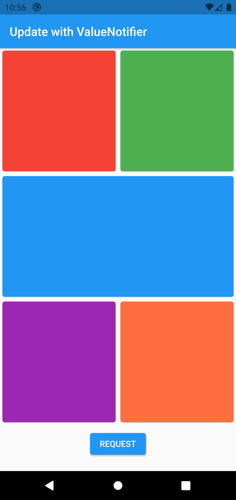
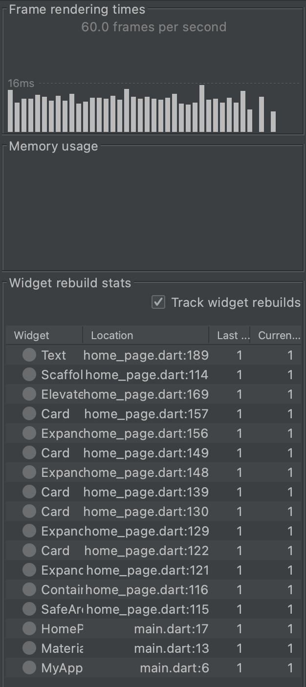
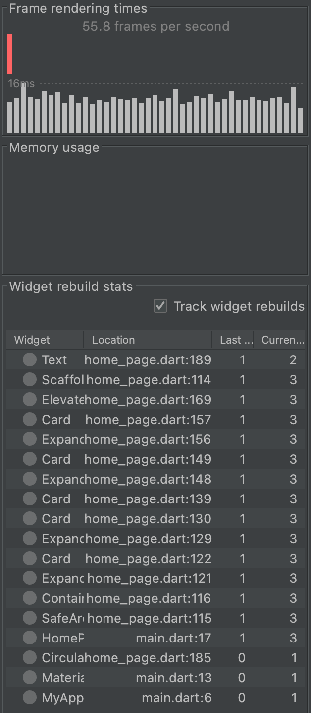
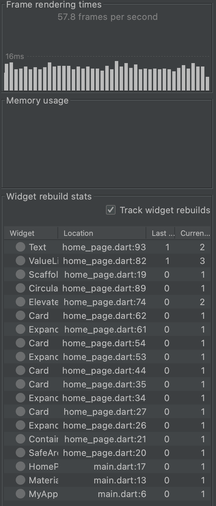

# flutter_fragmented_widgets

The difference measure between classic setState and ValueNotifier.

[https://medium.com/litslink/flutter-reduce-render-time-ed5580377428](https://medium.com/litslink/flutter-reduce-render-time-ed5580377428)

## State changing performance

|First launch|After setState|After ValueNotifier|
|-|-|-|
||||
